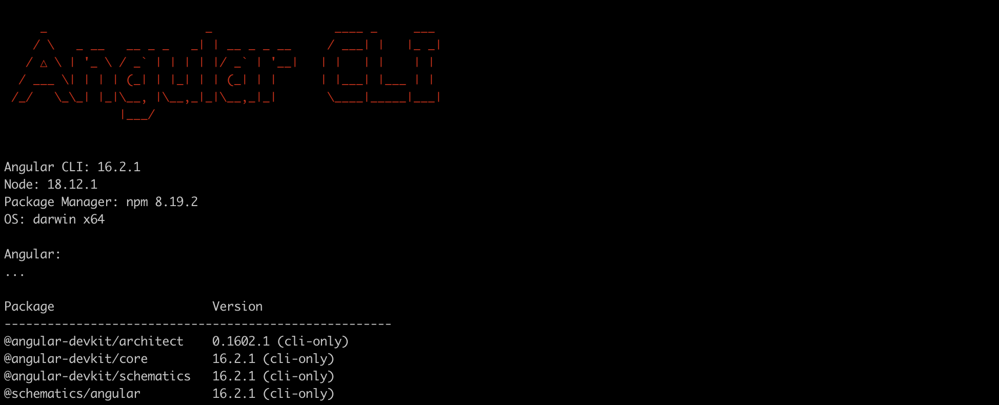

# INSTALLATION DE L'ENVIRONNEMENT ANGULAR

## 1 - Installation de node-js
```
 - Télécharger la version LTS de node js en fonction de votre système d'exploitation et du
 type d'architecture de votre ordinateur soit 32 bits ou 64 bits
 Lien : https://nodejs.org/en/download
```

## 2 - Installation de Angular
```
  - Installer Angular au moyen de la commande suivante : 

  npm install -g @angular/cli

  NB : Pour les utilisateurs de windows, veuillez executez cette commande depuis powershell.Mais avant il faudrait executer la commande ci-dessous en cas d'erreur: 

  Set-ExecutionPolicy -Scope CurrentUser -ExecutionPolicy RemoteSigned
```


## 3 - Vérification de l'installation
```
 si votre installation à reussir vous devez avoir à l'écran dans la ligne de commande :

 ng version

 si l'installation est réussie vous devez voir afficher le résultat comme sur l'image ci-dessous 

```
 